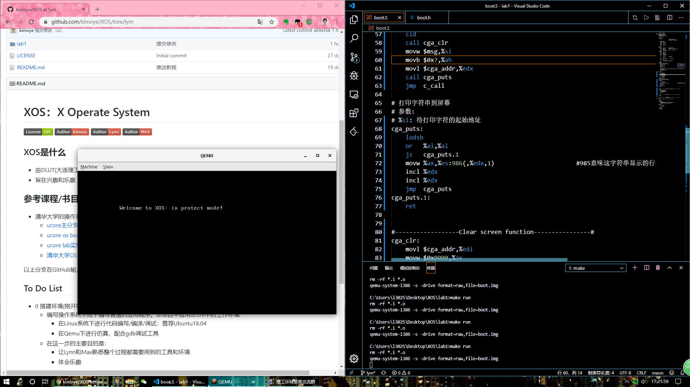

# XOS：X Operate System

## XOS是什么
- 由DLUT(大连理工大学)老年代码选手发起的业余操作系统项目
- 旨在兴趣和乐趣
## 参考课程/书目
- 清华大学的操作系统课程
  - [ucore主分支](https://github.com/chyyuu/ucore_os_docs)
  - [ucore os book](https://chyyuu.gitbooks.io/simple_os_book/)
  - [ucore lab实验指导书](https://chyyuu.gitbooks.io/ucore_os_docs/content/)
  - [清华大学OS课程主站](http://os.cs.tsinghua.edu.cn/oscourse/OS2018spring/)

以上分支在GitHub输入关键字即可找到更多信息
## To Do List
- 0 搭建环境(刚开始不需要十分理解，照做即可模拟出一台上个世纪的最简单计算机)
  - 编写操作系统不同于编写普通的应用程序。本项目中应用ucore中的工作环境:
    - 在Linux系统下进行代码编写/编译/调试：推荐Ubuntu18.04
    - 在Qemu下进行仿真，配合gdb调试工具
  - 在这一步的主要目的是：
    - 让Lynn和Max熟悉整个过程都需要用到的工具和环境
    - 体会乐趣
## 详细教程
- 0 [环境搭建：Ubuntu+Qemu](https://github.com/kimoye/XOS/blob/master/lab1/qemu.md)
  - 0.1 这一步网上的教程多如牛毛，但是需要注意几点：
    - 在Ubuntu下启动Qemu的命令为：qemu-system-i386,然后加上具体参数。
    - 建议在本小节的学习顺序为：先写启动代码-->学习如何生成启动扇区-->学习如何用Qemu+gdb调试
    - 有很多种方法完成实验，我个人只介绍我的思路和方法。Lynn、Max有好思路我也会合并。
    - 本小节中需用到的qemu/gdb命令和解释等见lab1/qemu.md
  - 0.2 启动扇区代码编写(代码见lab1/boot.s)
    - 代码中附有注释，阅读代码前应该先阅读清华实验书里面的相关细节。
  - 0.3 进入保护模式
    - makefile已经写好，make，make run即可直接运行。win10下使用wsl体验更顺滑。
    